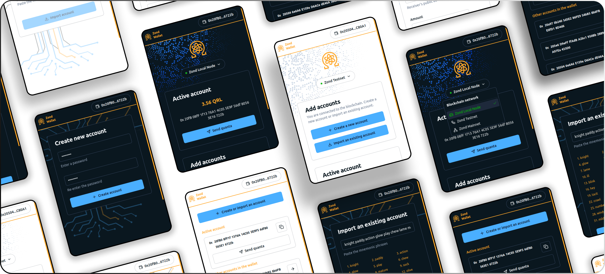

# Zond Wallet

A wallet for creating accounts, importing accounts and sending transactions over the zond blockchain. This is an extension for web browsers(like [Google Chrome](https://www.google.com/chrome/)), for performing operations on the [Zond](https://www.theqrl.org/blog/project-zond-qrls-next-generation-network-reaches-betatestnet/) blockchain.

## :keyboard: Run locally

- Run `git clone THIS_REPOSITORY_URL` for cloning this repo to your machine.
- Run `npm install` for installing all dependencies of this project.
- Run `npm run build` to generate a production build of the extension to the `Extension` folder.
- The production build output folder is named `Extension` (not `dist`) and this folder alone is enough to run the extension.
- Load the `Extension` folder as an extension package to the browser.

## :dna: Features list

| Feature              | Description                                                                                                                                                                                                                                       | Related files                                                                                   | Status         |
| -------------------- | ------------------------------------------------------------------------------------------------------------------------------------------------------------------------------------------------------------------------------------------------- | ----------------------------------------------------------------------------------------------- | -------------- |
| Extension manifest   | Browser extensions should always have this file in the project root directory, inorder to be considered an extension. Manifest file can be found inside the `public` folder, and will be copied to the output `Extension` directory during build. | [manifest.json](public/manifest.json)                                                           | :green_circle: |
| Theming              | Based on the system theme, extension will be displayed in light or dark theme.                                                                                                                                                                    | [index.css](src/index.css)                             | :green_circle: |
| Blockchain selection | The user can connect the wallet to a local zond node, zond testnet or zond mainnet. Mainnet can be used for real transactions, and the other two can be used for testing and demo.                                                                | [ConnectionBadge.tsx](src/components/ZondWallet/Body/Home/ConnectionBadge/ConnectionBadge.tsx)  | :green_circle: |
| Create account       | The user can create a new account just with the click of a button. The newly created account address along with its secret recovery phrases will be presented to the user for download.                                                           | [CreateAccount.tsx](src/components/ZondWallet/Body/CreateAccount/CreateAccount.tsx)             | :green_circle: |
| Import account       | If the user has recovery phrases of an account created in the past, that account can be imported to the wallet.                                                                                                                                   | [ImportAccount.tsx](src/components/ZondWallet/Body/ImportAccount/ImportAccount.tsx)             | :green_circle: |
| Account details      | The account address and available amount in the account will be displayed to the user.                                                                                                                                                            | [AccountDetails.tsx](src/components/ZondWallet/Body/AccountDetails/AccountDetails.tsx)          | :green_circle: |
| Account list         | List of accounts created or imported are stored locally, and displayed to the user. The user can switch to a different account in the wallet.                                                                                                     | [AccountList.tsx](src/components/ZondWallet/Body/AccountList/AccountList.tsx)                   | :green_circle: |
| User Password        | Ideally, the user entered password should be used to encrypt the account recovery phrases, so that the user can use their password for transactions each time. This needs to be first implemented in the zond web3.js library.                    | [AccountUnlock.tsx](src/components/ZondWallet/Body/Home/AccountUnlock/AccountUnlock.tsx)        | :red_circle:   |
| Transaction          | The user can send quanta to other addresses. The receiver's account address, the amount and the user's secret mnemonic phrases(user's password will be used in the future) are required to make the transaction.                                  | [AccountDetails.tsx](src/components/ZondWallet/Body/AccountDetails/AccountDetails.tsx)          | :green_circle: |
| Gas Fee              | Before making a transaction, the user can see an estimated gas fee amount.                                                                                                                                                                        | [GasFeeNotice.tsx](src/components/ZondWallet/Body/AccountDetails/GasFeeNotice/GasFeeNotice.tsx) | :green_circle: |
| Wallet connect       | Online dapps presents the user with a `Connect` button. To connect the wallet with the dapps, a zond object needs to be injected to the browser for all urls. Once this is implemented, users can login to dapps with the zond wallet.            |                                                                                                 | :red_circle:   |

## :hammer_and_wrench: Built with

[The QRL](https://github.com/theQRL/QRL), [Vite](https://vitejs.dev/), [React](https://react.dev/), [Typescript](https://www.typescriptlang.org/), [Jest](https://jestjs.io/), [MobX](https://mobx.js.org/README.html), [Shadcn](https://ui.shadcn.com/), [React hook form](https://www.react-hook-form.com/), [Tailwind](https://tailwindcss.com/)
